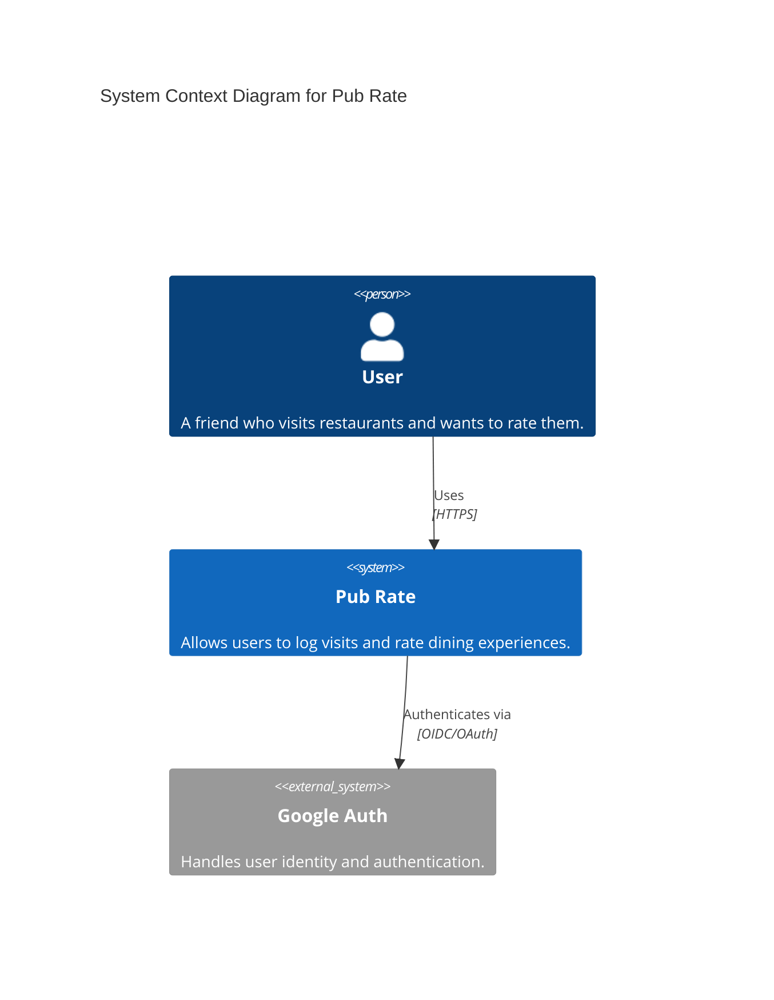
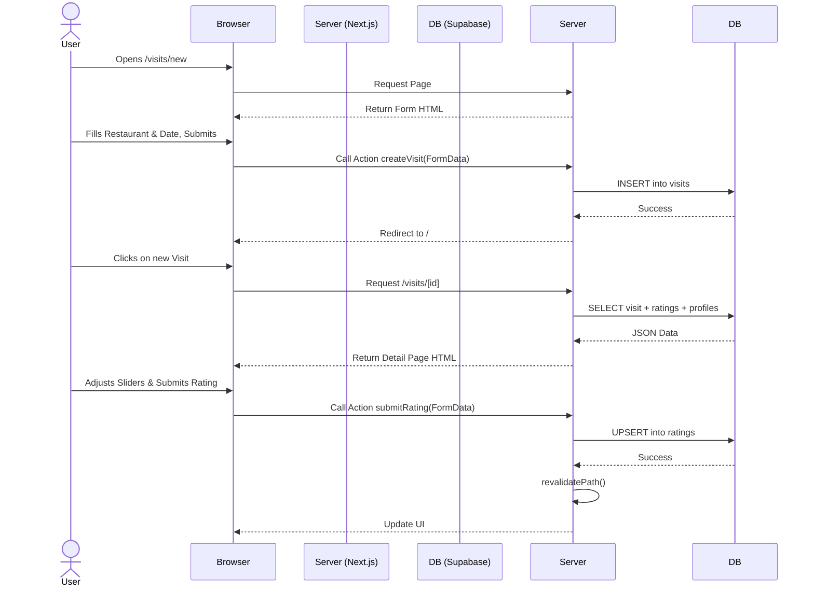
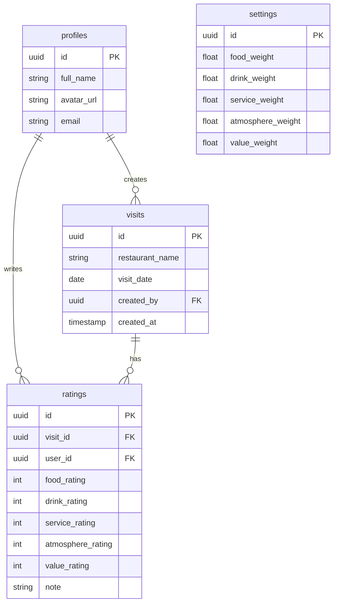

# Arc42 Documentation - Pub Rate

## 1. Introduction and Goals

**Pub Rate** is a social web application designed for a group of friends to track and rate their collective visits to restaurants, pubs, and cafes. It replaces ad-hoc tracking methods (like spreadsheets or generic chat groups) with a dedicated, mobile-friendly interface that aggregates scores and provides a leaderboard of best spots.

### 1.1 Requirements Overview
- **User Authentication**: Secure login via Google OAuth (Supabase Auth).
- **Visit Tracking**: Create records of visits to specific venues on specific dates.
- **Rating System**: Multi-criteria rating (Food, Drink, Service, Atmosphere, Value) with optional text notes.
- **Aggregation**: Real-time calculation of average scores per visit.
- **Localization**: Full Czech language support.
- **Responsive Design**: "Mobile-first" approach ensures usability on phones during visits.

### 1.2 Quality Goals
1.  **Usability**: The app must be intuitive and quick to use on mobile devices while at a restaurant.
2.  **Visual Appeal**: High-quality UI with animations (Framer Motion) and modern styling (Glassmorphism).
3.  **Simplicity**: Focus on the core value (rating) without unnecessary bloat.

### 1.3 Stakeholders
- **Users**: The group of friends using the app to rate places.
- **Developers**: Maintainers of the codebase (Next.js/Supabase).

---

## 2. Architecture Constraints

| Constraint       | Explanation                                    |
| :--------------- | :--------------------------------------------- |
| **Tech Stack**   | Next.js 14 (App Router), React, Tailwind CSS.  |
| **Backend / DB** | Supabase (PostgreSQL, Auth, Realtime).         |
| **Hosting**      | Vercel (Frontend), Supabase (Backend).         |
| **Budget**       | Free tier focus (Vercel Hobby, Supabase Free). |
| **Language**     | Czech (UI).                                    |

---

## 3. System Scope and Context

Pub Rate interacts primarily with its users and the external identity provider (Google).

### 3.1 Business Context



---

## 4. Solution Strategy

The solution relies on a **Serverless** architecture to minimize maintenance and cost.

- **Frontend**: **Next.js** handles routing, UI rendering, and interaction. It uses **Server Components** for data fetching and **Server Actions** for mutations (form submissions), providing a secure and type-safe bridge to the backend without a separate API layer.
- **Backend & Database**: **Supabase** provides a managed PostgreSQL database. All business logic regarding data integrity (e.g., cascade deletes, default values) is enforced at the database level using SQL constraints and Triggers.
- **Security**: **Row Level Security (RLS)** in PostgreSQL ensures that API endpoints (exposed via Supabase client) respect user permissions.
- **State Management**: React Server Server Components + simple client state (useState) for forms. No complex global state library (Redux/Zustand) is needed due to the flat hierarchy.

---

## 5. Building Block View

### 5.1 Level 1: Whitebox Overall System

```mermaid
flowchart TB
    subgraph Client [User Browser]
        UI[Next.js Client Components]
        BrowserClient[Supabase Browser Client]
    end

    subgraph Vercel [Next.js Server]
        ServerComp[Server Components]
        ServerActions[Server Actions]
        ServerClient[Supabase Server Client]
    end

    subgraph Supabase [Backend Platform]
        Auth[GoTrue (Auth)]
        DB[(PostgreSQL)]
    end

    UI --> ServerActions
    UI -.-> |Realtime Subscriptions| DB
    ServerComp --> ServerClient
    ServerActions --> ServerClient
    ServerClient --> DB
    ServerClient --> Auth
```

### 5.2 Key Components

1.  **App Router (`/app`)**:
    *   `layout.tsx`: Defines the root layout, fonts, and metadata.
    *   `page.tsx`: The main dashboard displaying the list of visits.
    *   `/login`: Authentication flow.
    *   `/visits/new`: Form to create a new visit.
    *   `/visits/[id]`: Detail view of a visit, including the `ScoreDisplay`, `RatingForm`, and list of reviews.
    *   `/settings`: Configuration for rating calculation weights.

2.  **Server Actions (`actions.ts`)**:
    *   Handle form submissions (`createVisit`, `submitRating`, `deleteVisit`, `updateSettings`).
    *   Perform server-side validation and database mutations.
    *   Trigger cache revalidation (`revalidatePath`).

3.  **Database Components**:
    *   **Tables**: `profiles`, `visits`, `ratings`, `settings`.
    *   **RLS Policies**: Enforce who can read/write data.

---

## 6. Runtime View

### 6.1 Create & Rate Visit Flow

Accessing the app, creating a visit, and adding a rating.



---

## 7. Deployment View

The application follows a standard Vercel + Supabase deployment model.

- **Production Environment**:
    - **Frontend**: Deployed to Vercel Edge Network. Automatically built from `main` branch.
    - **Database**: Supabase manage instance (Cloud).
- **Environment Variables**:
    - `NEXT_PUBLIC_SUPABASE_URL`: API Endpoint.
    - `NEXT_PUBLIC_SUPABASE_ANON_KEY`: Public API Key.

---

## 8. Data Model (ERD)

The PostgreSQL schema is central to the application logic.



---

## 9. Cross-cutting Concepts

### 9.1 Localization (i18n)
The application uses a hardcoded single-language approach (Czech) for simplicity, as the target audience is specific. All UI strings are directly translated in the TSX files.

### 9.2 Styling (Theming)
- **Tailwind CSS** is used for utility-first styling.
- **Dark Mode**: The design assumes a dark theme (`bg-zinc-950`) by default to create a premium "night-out" aesthetic.
- **Animation**: `framer-motion` handles page transitions and micro-interactions (e.g., bar chart filling, modal appearance).

### 9.3 Error Handling
- Server Actions return void or throw errors which are logged server-side.
- UI handles basic empty states (e.g., "No visits recorded yet").
- **Future Impr**: Add structured error toasts (Sonner/Toast).

---

## 10. Design Decisions

| Decision          | Option Selected       | Rationale                                                                            |
| :---------------- | :-------------------- | :----------------------------------------------------------------------------------- |
| **Framework**     | Next.js App Router    | Modern standard, server components reduce bundle size, excellent Vercel integration. |
| **Auth Provider** | Google (via Supabase) | Minimal friction for users, no password management needed.                           |
| **Styling**       | Tailwind CSS          | Rapid prototyping, standard design tokens.                                           |
| **Validations**   | Client + Server       | HTML5 form validation for UX, DB constraints for integrity.                          |

---

## 11. Glossary

- **Visit**: A record of a group trip to a specific establishment on a specific date.
- **Rating**: An individual user's score (1-10) for a visit across 5 categories.
- **Settings**: Global weights that determine how the "Overall Score" is calculated from the 5 categories (currently not fully implemented in calculation logic, acts as visual configuration).
